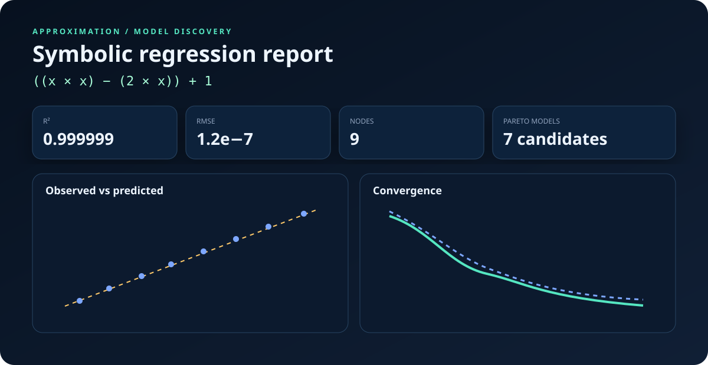
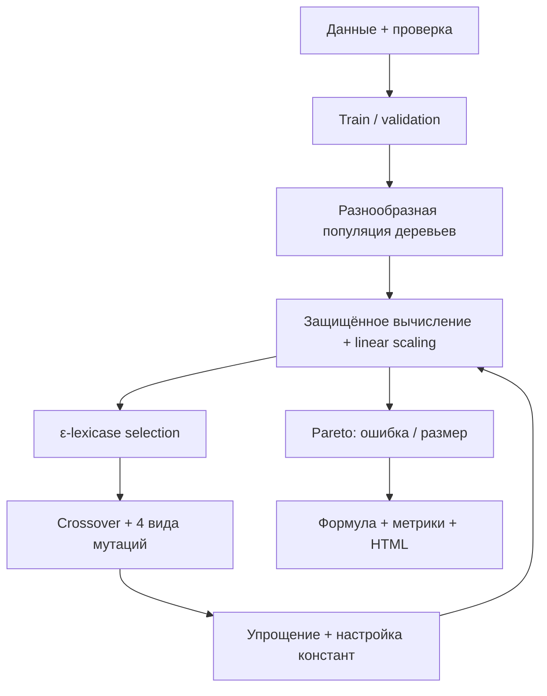

# Approximation

**Интерпретируемая символическая регрессия для .NET 8:** библиотека сама ищет формулу `y = f(x₀, x₁, …)` по табличным данным, оценивает её на отложенной выборке и возвращает не только одно выражение, но и Парето‑фронт моделей «точность ↔ сложность».



## Что умеет

- одномерная и многомерная регрессия без заранее заданного вида уравнения;
- воспроизводимый поиск с фиксированным `Seed`;
- ε‑lexicase или турнирный отбор родителей;
- ramped half‑and‑half инициализация, элитизм и случайные «иммигранты»;
- subtree crossover, subtree/point/constant/hoist mutation;
- аналитическая линейная подстройка масштаба и смещения каждого выражения;
- локальная оптимизация числовых констант;
- Huber, MSE или MAE как целевая функция;
- validation split, ранняя остановка и защита от переобучения размером дерева;
- защищённые операции без `NaN`/`Infinity`;
- метрики `MSE`, `RMSE`, `MAE`, `R²` и validation loss;
- полностью автономный HTML‑отчёт с SVG‑графиками, без CDN и `eval`;
- готовый CSV CLI, тесты и GitHub Actions.

## Быстрый старт

```csharp
using ApproximationLib;

double[] x = { -3, -2, -1, 0, 1, 2, 3, 4, 5, 6 };
double[] y = { 16, 9, 4, 1, 0, 1, 4, 9, 16, 25 }; // (x - 1)²

var regressor = new SymbolicRegressor(new Config
{
    Seed = 2026,
    PopulationSize = 800,
    MaxGenerations = 300
});

Result result = regressor.Fit(x, y);

Console.WriteLine(result.BestFormula);
Console.WriteLine($"R² = {result.R2:F6}");
Console.WriteLine(result.Function(2.5));
```

### Несколько переменных

Строки массива — наблюдения, столбцы — признаки.

```csharp
double[][] x =
{
    new[] { 1.0, 2.0 },
    new[] { 2.0, 3.0 },
    new[] { 3.0, 4.0 },
    new[] { 4.0, 5.0 }
};
double[] y = x.Select(row => 2 * row[0] * row[1] + 1).ToArray();

Result result = new SymbolicRegressor().Fit(x, y, new[] { "pressure", "temperature" });
double prediction = result.Predict(2.5, 3.5);
```

### CSV из командной строки

Файл должен содержать заголовок и только числовые столбцы. Разделитель `,`, `;` или tab определяется автоматически.

```bash
dotnet run --project Approximation -- \
  --csv measurements.csv \
  --target force \
  --auto \
  --seed 2026 \
  --report report.html
```

Демонстрационный прогон без CSV:

```bash
dotnet run --project Approximation -- --report report.html
```

## Как устроен поиск



Fitness нормируется на дисперсию целевой переменной, поэтому коэффициент сложности ведёт себя предсказуемее на данных разного масштаба:

$$
F(f)=\frac{L(y,f(X))}{\operatorname{Var}(y)+\varepsilon}+\lambda\,|f|.
$$

При стандартном `Huber` loss отдельная ошибка $e$ оценивается как

$$
L_\delta(e)=
\begin{cases}
\frac{1}{2}e^2, & |e|\le\delta,\\
\delta(|e|-\frac{1}{2}\delta), & |e|>\delta.
\end{cases}
$$

Это делает поиск устойчивее к единичным выбросам, сохраняя поведение MSE около нуля.

## Защищённые операции

| Группа | Операции | Поведение на опасном аргументе |
|---|---|---|
| Арифметика | `+`, `-`, `*`, `protectedDiv` | деление на почти ноль возвращает числитель |
| Степени | `pow`, `sqrt` | показатель ограничен; `sqrt(abs(x))` |
| Логарифмы | `log`, `log10` | вычисляется от `abs(x) + ε` |
| Тригонометрия | `sin`, `cos`, `tan`, `asin`, `acos`, `atan` | домен и полюса защищены |
| Гиперболические | `sinh`, `cosh`, `tanh` | аргумент растущих функций ограничен |
| Прочие | `abs`, `exp`, `min`, `max` | `exp` получает ограниченный аргумент |

Любой нечисловой или бесконечный входной элемент отклоняется до запуска эволюции. Числа в деревьях всегда записываются и разбираются через invariant culture, поэтому одна и та же модель одинаково работает при `ru-RU`, `de-DE` и `en-US`.

## Настройка

```csharp
var config = new Config
{
    PopulationSize = 1200,
    MaxGenerations = 400,
    MaxDepth = 8,
    MaxNodes = 95,
    Selection = ParentSelection.EpsilonLexicase,
    Loss = LossFunction.Huber,
    HuberDelta = 1.0,
    ValidationFraction = 0.2,
    EarlyStoppingPatience = 50,
    ParsimonyCoefficient = 0.001,
    ConstantOptimizationInterval = 10,
    ParallelEvaluation = true,
    Seed = 42,
    GenerateReport = true,
    OutputPath = "report.html"
};
```

Для быстрого автоматического выбора бюджета поиска используйте `AutoFit(...)`. Для контролируемого эксперимента лучше явно фиксировать `Config` и `Seed`.

## Что возвращает Result

| Поле | Значение |
|---|---|
| `BestFormula` | читаемая инфиксная формула |
| `FunctionalFormula` | однозначная функциональная запись дерева |
| `Function` | совместимый делегат для одной переменной |
| `MultiFunction`, `Predict` | предсказание для нескольких признаков |
| `MSE`, `RMSE`, `MAE`, `R2` | итоговые метрики на всех переданных данных |
| `ValidationLoss` | качество выбранной модели на holdout |
| `ParetoFront` | недоминируемые решения разной сложности |
| `History` | история сходимости по поколениям |

## Научная основа

Реализация не копирует одну конкретную систему, а объединяет проверенные идеи из современной символической регрессии:

- сама постановка поиска свободной аналитической формы следует линии Schmidt & Lipson, *Distilling Free-Form Natural Laws from Experimental Data*, Science (2009), [DOI: 10.1126/science.1165893](https://www.science.org/doi/10.1126/science.1165893);
- ε‑lexicase selection применён как устойчивый к разным «трудным случаям» механизм отбора: La Cava et al., *Epsilon-Lexicase Selection for Regression* (GECCO 2016), [DOI: 10.1145/2908812.2908898](https://dl.acm.org/doi/10.1145/2908812.2908898);
- Парето‑фронт ошибки и сложности основан на многокритериальном подходе, рассмотренном в Kommenda et al., *Complexity Measures for Multi-objective Symbolic Regression* (2021), [arXiv:2109.00238](https://arxiv.org/abs/2109.00238), и используется также в AI Feynman 2.0, [arXiv:2006.10782](https://arxiv.org/abs/2006.10782);
- отдельная настройка ephemeral random constants добавлена потому, что она существенно влияет на качество GP‑поиска; обзор и сравнение методов: Reis et al., *Benchmarking symbolic regression constant optimization* (2024), [arXiv:2412.02126](https://arxiv.org/abs/2412.02126).

Практические следствия этих работ в коде: разнообразный отбор вместо выбора только по среднему MSE, ограничение bloat, сохранение нескольких недоминируемых гипотез, настройка коэффициентов во время эволюции и обязательная проверка обобщения.

## Сборка и проверка

```bash
dotnet restore Approximation.sln
dotnet build Approximation.sln -c Release -warnaserror
dotnet run --project Approximation.Tests -c Release
```

Тестовый executable не требует сторонних NuGet‑пакетов. Он проверяет локаленезависимые константы, защищённую арифметику, воспроизводимость, одномерный и многомерный поиск, валидацию входа и автономность отчёта. Те же команды выполняются в GitHub Actions.

## Ограничения

- символическая регрессия — стохастический комбинаторный поиск, поэтому сложная формула может потребовать нескольких seed или большего бюджета;
- найденная корреляция сама по себе не доказывает физическую причинность;
- экстраполяцию за диапазон обучающих данных необходимо проверять отдельно;
- для размерных физических задач набор операций следует ограничивать предметно допустимыми функциями;
- CSV‑CLI намеренно строгий: пропуски и категориальные признаки нужно обработать заранее.
